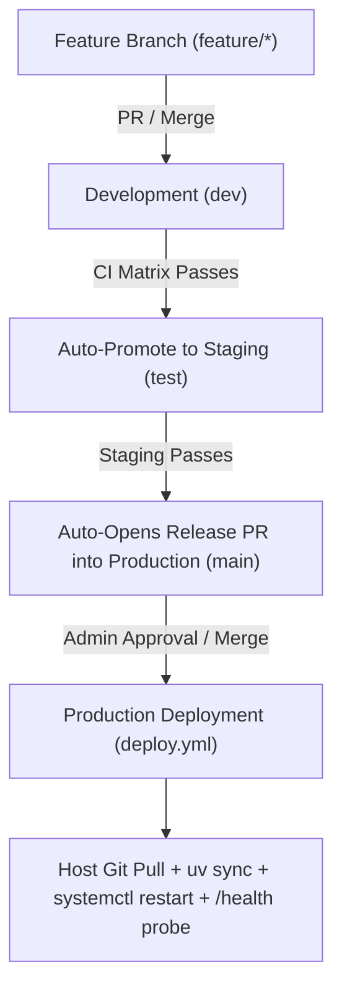

# 🚀 Production Deployment & Branch Protection Guide

This guide outlines how the automated CI/CD pipeline and branch protection gates operate for **Palworld Operations Suite**.

---

## 🏗️ 1. Branch Promotion Flow

1. **Development (`dev`)**: Active feature integration branch.
2. **Staging (`test`)**: When code lands on `dev` and passes all 9 quality tiers, GitHub Actions automatically promotes and merges `dev` into `test`.
3. **Production (`main`)**: When code lands on `test` and passes verification, GitHub Actions automatically creates a Release Pull Request from `test` into `main`. Merging into `main` triggers the production deployment pipeline.

---

## 🛡️ 2. Recommended Branch Protection Settings (GitHub UI)

To ensure that broken code or unverified commits can never be merged into production or staging, configure Branch Protection in GitHub:

1. Go to your GitHub repository: **`Settings` $\rightarrow$ `Branches` $\rightarrow$ `Add branch ruleset` / `Add rule`**.
2. Set **Branch name pattern**: `main` (and repeat for `test` and `dev`).
3. Check the following options:
   - ✅ **Require a pull request before merging**
   - ✅ **Require status checks to pass before merging**:
     - Search for and select: `Quality, Security & Multi-Python Matrix (3.10)`, `(3.11)`, `(3.12)`, and `(3.13)`.
   - ✅ **Require branches to be up to date before merging**
   - ✅ **Do not allow bypassing the above settings**

---

## 🔐 3. Configuring Production Deployment Secrets (Optional)

If you would like GitHub Actions to automatically SSH into your Linux host and reload `palworld-manager.service` upon merging to `main`:

1. In your GitHub repository, navigate to **`Settings` $\rightarrow$ `Secrets and variables` $\rightarrow$ `Actions` $\rightarrow$ `New repository secret`**.
2. Add the following secrets:

| Secret Name | Description | Example Value |
| :--- | :--- | :--- |
| `PROD_HOST` | Hostname or Public IP of your Linux server | `palworld.yourdomain.duckdns.org` |
| `PROD_USER` | SSH Username on the server | `palworld` or `steam` |
| `PROD_SSH_KEY` | Private SSH Key content with access to the host | `(Contents of your id_ed25519 private key)` |
| `PROD_PORT` | SSH Port (default: 22) | `22` |
| `PROD_APP_DIR` | Absolute path where the service is cloned | `/opt/palworld_server_service` |
| `PROD_PUBLIC_URL` | Public base URL for automated `/health` probing | `https://palworld.yourdomain.duckdns.org:8213` |
