# Palworld Dedicated Server Operations Suite & Web Management Plane

An enterprise-grade, non-disruptive operations plane, real-time dashboard, and Prometheus-style observability engine for Linux-hosted Palworld dedicated servers.

---

## 🌟 Core Capabilities

### 1. 🎛️ World Settings Management
- Live Unreal Engine `OptionSettings` INI parser and serializer.
- Granular multipliers (EXP rates, capture rates, damage multipliers, stamina depletion, structure decay, egg incubation).
- Isolated Git configuration snapshots with diff inspection and one-click rollback.
- Physical isolation and masking of sensitive server credentials (`AdminPassword`, `ServerPassword`, RCON ports).

### 2. 👥 Real-Time Player Roster & Administration
- Live session tracking: Player Level, Ping, World Coordinates, Steam/EOS ID.
- In-game administrative actions: Immediate broadcast notices, kick player, and permanent ban.
- Persistent player history ledger (`players.json`).

### 3. 📊 Engine & Bare-Metal Telemetry
- Simulation tick rate (FPS), frame delivery times, world in-game day counter, server uptime.
- Host metrics: Linux cgroup memory utilization vs. 14GB allocation cap, NVMe disk metrics, network I/O throughput, per-core CPU load.

### 4. 📈 Dedicated Time-Series Observability & Metrics Engine
- Physically isolated SQLite metrics database (`metrics.db` in WAL mode), independent of core configuration and auth data.
- **In-Memory Streaming Buffer**: Thread-safe high-resolution snapshots buffered in RAM, writing to disk every 5 minutes (or 1,000 items) via bulk atomic `executemany` operations.
- **Zero Data Loss Guarantee**: Flushes in-flight metrics to disk on graceful service shutdown (`lifespan`) and before servicing API telemetry queries.
- **Rolling 30-Day Retention Pruner**: Automatically purges telemetry records older than 30 days.
- **Prometheus/Grafana-Style Observability Dashboard**: Served at `/observability` and `/metrics` featuring dark-mode aesthetic, dual-axis FPS/frame time charts, concurrency tracking, cgroup RAM usage, time-range selectors (`1h`, `6h`, `24h`, `7d`, `30d`), auto-refresh toggles, and downsampled historical aggregations.

### 5. 🔐 User Authentication & Role-Based Access Control (RBAC)
- Secure user credential storage using bcrypt hashing in SQLite (`palmanager.db`).
- Session token authentication (`/api/auth/login`, `/logout`, `/me`).
- Granular RBAC permissions:
  - `admin`: Full cluster administrative privileges (server reboots, configuration edits, user management, moderation).
  - `moderator`: In-game player administration (broadcast, kick, ban).
  - `viewer`: Read-only access to operations metrics, telemetry, and observability.
- User management API (`/api/users`) and persistent login audit trail.

### 6. 💬 Issue Tracking & User Feedback Portal
- In-app feedback and bug submission portal (`/api/feedback`) directly mapped to GitHub issue templates.
- SQLite persistence of user feedback with lifecycle state tracking (`open`, `investigating`, `resolved`).

### 7. 🔄 Lifecycle & Scheduled Reboot Automation
- Automated 4-hour reboot cycles with progressive in-game HUD countdown notifications (10m, 5m, 3m, 1m, 30s).
- Guaranteed world state save before process restart.
- SteamCMD auto-update flag orchestration.

### 8. 🌐 Network & Matchmaking Matrix
- BattleMetrics directory tracking with exponential backoff for 429 rate limits.
- DuckDNS dynamic DNS synchronization (every 5 minutes) with DNS A-record verification.

---

## 🌳 Git Branching & Promotion Pipeline (Modern GitHub Flow)

The repository follows **Modern GitHub Flow** with single-branch protection on `main` and high-speed parallel Pull Request status gates:

```mermaid
flowchart TD
    subgraph Development ["1. Ephemeral Topic Branch"]
        M_BASE["main (Production Source of Truth)"] -->|gitflow.sh feature <name>| F["feature/<name>"]
        F -->|./quality_script.sh -a| PASS["Local Master Quality Pass (15 Checks)"]
    end

    subgraph PRGate ["2. Pull Request Gate (Target: main)"]
        PASS -->|gitflow.sh pr| PR["Pull Request (base: main)"]
        
        subgraph ParallelCI ["All-in-One Parallel CI Status Checks (ci.yml)"]
            direction LR
            C1["Zero-Leak Secret Scan"]
            C2["Suppression Audit"]
            C3["AST Exception Audit"]
            C4["pip-audit (CVEs)"]
            C5["Bandit SAST"]
            C6["Ruff Linter"]
            C7["Mypy Strict Types"]
            C8["Pylint (10.00/10)"]
            C9["pycodestyle (PEP 8)"]
            C10["pydocstyle"]
            C11["pytest Coverage"]
            C12["Clean Install & Idempotency"]
            C13["Python 3.10 Matrix"]
            C14["Python 3.11 Matrix"]
            C15["Python 3.12 Matrix"]
            C16["Python 3.13 Matrix"]
        end

        PR --> ParallelCI
        ParallelCI --> GATE["ci-gate: All CI Quality Gates Passed"]
        GATE --> MERGE["Maintainer Review & Merge"]
    end

    subgraph Production ["3. Production Release & Deployment"]
        MERGE -->|push to main| DEP["deploy.yml<br/>(Host Deployment & Health Probes)"]
        DEP --> PROD[Dedicated Server Deployment]
    end
```



### Branch Environments & Access Governance
1. **`main` (Production & Release Source of Truth)**:
   - Protected: All direct commits are strictly prohibited.
   - All code enters `main` exclusively through Pull Requests that pass all 15 automated CI status checks.
   - Merges to `main` trigger [`.github/workflows/deploy.yml`](.github/workflows/deploy.yml) for production deployment.
2. **`feature/*` & `bugfix/*` (Ephemeral Topic Branches)**:
   - Branched directly from latest `main`.
   - Verified locally with `./quality_script.sh -a` before submission.
   - See [CONTRIBUTING.md](CONTRIBUTING.md) for contributor guidelines.
3. **Automated Branch Protection Setup**:
   - Run `./scripts/setup_branch_protection.sh` to configure GitHub branch protection rules via GitHub CLI or API.

---

## 🛡️ Hard Enforcement Governance Rules

1. **Rule 1: Zero Direct Commits to `main`**
   - Direct commits to `main` are strictly forbidden. Enforced locally via Git `pre-commit` hook installed by `./scripts/gitflow.sh install-hooks`.
2. **Rule 2: Only Merge on 100% Green Status Checks**
   - Merges into `main` are blocked by GitHub branch protection until all 15 checks in `ci.yml` pass.
3. **Rule 3: Full Local & Remote Check Parity (Strictly Duplicative)**
   - Before submitting a PR, developers run `./quality_script.sh -a` which executes all 15 checks locally. Remote CI repeats all 15 checks in parallel.
4. **Rule 4: Project-Wide Suppression Passphrase Guard**
   - Prohibited from adding project-wide suppressions (`pyproject.toml` `disable = [...]`, Ruff ignores, Mypy broad ignores) without explicit user authorization stating the exact passphrase:
     > **"I solemnly swear I know what I’m doing"**
   - Enforced by `scripts/audit_suppressions.py`.
5. **Rule 5: The 3 AM Debugger Standard**
   - All code generation, features, and bug fixes strictly follow `/the-3am-debugger`: radical clarity, flat linear logic, physical type isolation, defensive typing (zero `Any`), 12-factor compliance, and comprehensive intent documentation.
6. **Rule 6: Pull Requests Target `main` Exclusively**
   - All Pull Requests must target `main`.

---

## 🛠️ Gitflow & GitHub Flow CLI Automation (`./scripts/gitflow.sh`)

Manage development lifecycles effortlessly using the unified CLI:

```bash
# 1. Start a new feature or bugfix (branching off latest main)
./scripts/gitflow.sh feature my-new-feature
./scripts/gitflow.sh bugfix patch-login-issue

# 2. Run local master quality suite across all directories
./quality_script.sh -a

# 3. Push branch and open Pull Request targeting main
./scripts/gitflow.sh pr "feat: add my new feature"

# 4. Check pipeline and branch status
./scripts/gitflow.sh status
# 5. Install repository pre-commit hook protecting main
./scripts/gitflow.sh install-hooks
```

---

## 🔍 Quality & Security Suite (`./quality_check.sh` / `./quality_script.sh`)

The suite rigorously tests all directories across the project:

```bash
# Run master quality suite (Security, Suppressions, AST, Bandit, Ruff, MyPy, Pylint 10/10, PyCodeStyle, PyDocStyle, PyTest Coverage)
./quality_check.sh -a
# Or using the forwarding wrapper:
./quality_script.sh -a

# Run multi-Python matrix test (Python 3.10, 3.11, 3.12, 3.13)
./quality_check.sh -m

# Run security checks only (Bandit, pip-audit, secret scanner, suppression audit)
./quality_check.sh -s

# Run linting checks only (Ruff, MyPy, Pylint 10.00/10, PyCodeStyle, PyDocStyle)
./quality_check.sh -l

# Run unit test suite
./quality_check.sh -t
```

---

## 🚀 Quickstart & Local Development

This project is managed with [uv](https://astral.sh/uv).

### 1. Prerequisites
- Python 3.10+
- `uv` package manager (`curl -LsSf https://astral.sh/uv/install.sh | sh`)

### 2. Install Dependencies
```bash
uv sync --all-groups
```

### 3. Install Pre-Commit Governance Hooks
```bash
./scripts/gitflow.sh install-hooks
```

### 4. Run Test Suite
```bash
uv run pytest
```

### 5. Start Local Development Server
```bash
uv run uvicorn app.main:app --reload --port 8080
```
- **Operations Dashboard**: [http://localhost:8080](http://localhost:8080)
- **Prometheus Observability View**: [http://localhost:8080/observability](http://localhost:8080/observability)
- **Interactive API Documentation (Swagger)**: [http://localhost:8080/docs](http://localhost:8080/docs)
- **Default Bootstrap Credentials**: Username `admin` / Password `admin` (change immediately on first boot)

---

## 🖥️ Production Server Deployment & Universal Installation

The operations suite supports multi-distribution deployment across Debian/Ubuntu, RHEL/Rocky Linux/CentOS/AlmaLinux, Arch Linux, openSUSE, and Alpine Linux.

### 1. Standalone Single Binary Compilation (Recommended for Zero Runtime Dependencies)
To eliminate Python runtime dependencies, package managers, and virtualenvs on production hosts, compile the operations suite into a standalone single ELF executable using PyInstaller:

```bash
# Compiles app/main.py and all ASGI/FastAPI assets into dist/palworld-manager
./scripts/build_binary.sh
```

When `dist/palworld-manager` is present:
- `scripts/install.sh` automatically installs it directly to `/usr/local/bin/palworld-manager`.
- `palworld-manager.service` prioritizes executing `/usr/local/bin/palworld-manager`, achieving instant startup without an active Python virtual environment.

### 2. Universal Multi-Distro Installation (Linux Server)
Run the automated installation script as root or with sudo:

```bash
chmod +x palworld-run.sh
sudo ./palworld-run.sh
```

The installer automatically adapts to the host operating system:
1. **Multi-Package Manager Detection**: Identifies and provisions native C build tools and runtime dependencies across:
   - **Debian / Ubuntu**: `apt-get`
   - **RHEL / Rocky / CentOS / Fedora / AlmaLinux**: `dnf` / `yum`
   - **Arch Linux**: `pacman`
   - **openSUSE**: `zypper`
   - **Alpine Linux**: `apk`
2. **Dual Execution Runtime**:
   - If a standalone binary (`dist/palworld-manager`) is present, installs it to `/usr/local/bin/palworld-manager`.
   - If deploying from source, builds an isolated virtualenv under `/opt/palworld-web-manager/.venv`. If `uv` is unavailable, it automatically falls back to standard library `python3 -m venv` and compiles C-extensions natively using system `gcc` and `make` (zero third-party binary curl downloads).
3. **Security & Privilege Isolation**:
   - Provisions the dedicated unprivileged service account `palmanager`.
   - Applies strict POSIX Access Control Lists (ACLs) across `/home/steam` and DuckDNS.
   - Configures granular `/etc/sudoers.d/palworld_manager_palmanager` scoped only to `systemctl` actions on `palworld.service` and `ufw status`.
4. **Daemon Deployment & Crontab Registration**:
   - Installs dual-mode `palworld-manager.service` (port 8080).
   - Configures DuckDNS dynamic DNS synchronization (every 5 minutes).
   - Configures automated 4-hour reboot cycles with graceful HUD countdown notifications.

### 3. Zero-Drift Server Updates
To update the server to the latest production release without disrupting in-game players:
```bash
sudo ./scripts/deploy.sh main
```
