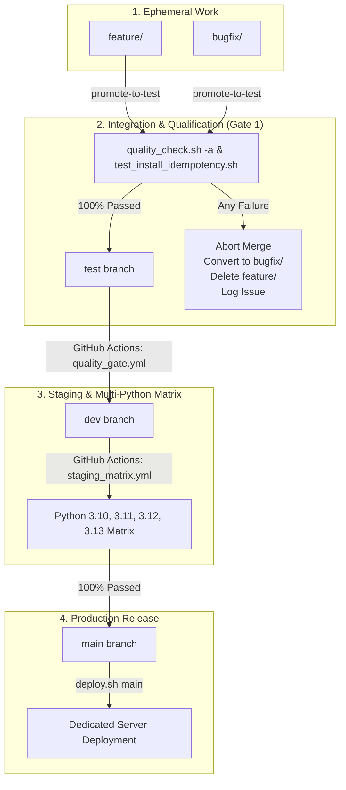

# Palworld Dedicated Server Operations Suite & Web Management Plane

An enterprise-grade, non-disruptive operations plane, real-time dashboard, and Prometheus-style observability engine for Linux-hosted Palworld dedicated servers.

---

## 🌟 Core Capabilities

### 1. 🎛️ World Settings Management
- Live Unreal Engine `OptionSettings` INI parser and serializer.
- Granular multipliers (EXP rates, capture rates, damage multipliers, stamina depletion, structure decay, egg incubation).
- Isolated Git configuration snapshots with diff inspection and one-click rollback.
- Physical isolation and masking of sensitive server credentials (`AdminPassword`, `ServerPassword`, RCON ports).

### 2. 👥 Real-Time Player Roster & Administration
- Live session tracking: Player Level, Ping, World Coordinates, Steam/EOS ID.
- In-game administrative actions: Immediate broadcast notices, kick player, and permanent ban.
- Persistent player history ledger (`players.json`).

### 3. 📊 Engine & Bare-Metal Telemetry
- Simulation tick rate (FPS), frame delivery times, world in-game day counter, server uptime.
- Host metrics: Linux cgroup memory utilization vs. 14GB allocation cap, NVMe disk metrics, network I/O throughput, per-core CPU load.

### 4. 📈 Dedicated Time-Series Observability & Metrics Engine
- Physically isolated SQLite metrics database (`metrics.db` in WAL mode), independent of core configuration and auth data.
- **In-Memory Streaming Buffer**: Thread-safe high-resolution snapshots buffered in RAM, writing to disk every 5 minutes (or 1,000 items) via bulk atomic `executemany` operations.
- **Zero Data Loss Guarantee**: Flushes in-flight metrics to disk on graceful service shutdown (`lifespan`) and before servicing API telemetry queries.
- **Rolling 30-Day Retention Pruner**: Automatically purges telemetry records older than 30 days.
- **Prometheus/Grafana-Style Observability Dashboard**: Served at `/observability` and `/metrics` featuring dark-mode aesthetic, dual-axis FPS/frame time charts, concurrency tracking, cgroup RAM usage, time-range selectors (`1h`, `6h`, `24h`, `7d`, `30d`), auto-refresh toggles, and downsampled historical aggregations.

### 5. 🔐 User Authentication & Role-Based Access Control (RBAC)
- Secure user credential storage using bcrypt hashing in SQLite (`palmanager.db`).
- Session token authentication (`/api/auth/login`, `/logout`, `/me`).
- Granular RBAC permissions:
  - `admin`: Full cluster administrative privileges (server reboots, configuration edits, user management, moderation).
  - `moderator`: In-game player administration (broadcast, kick, ban).
  - `viewer`: Read-only access to operations metrics, telemetry, and observability.
- User management API (`/api/users`) and persistent login audit trail.

### 6. 💬 Issue Tracking & User Feedback Portal
- In-app feedback and bug submission portal (`/api/feedback`) directly mapped to GitHub issue templates.
- SQLite persistence of user feedback with lifecycle state tracking (`open`, `investigating`, `resolved`).

### 7. 🔄 Lifecycle & Scheduled Reboot Automation
- Automated 4-hour reboot cycles with progressive in-game HUD countdown notifications (10m, 5m, 3m, 1m, 30s).
- Guaranteed world state save before process restart.
- SteamCMD auto-update flag orchestration.

### 8. 🌐 Network & Matchmaking Matrix
- BattleMetrics directory tracking with exponential backoff for 429 rate limits.
- DuckDNS dynamic DNS synchronization (every 5 minutes) with DNS A-record verification.

---

## 🌳 Git Branching & Promotion Pipeline (Gitflow)

The repository strictly enforces a multi-tier Gitflow architecture with automated qualification gates:



### Branch Environments
1. **`main` (Production)**: Stable production code deployed directly to the dedicated server. Only receives code that has passed the staging gate and multi-Python matrix.
2. **`dev` (Staging)**: Staging environment directly preceding production. Must pass tests across all supported Python versions (**Python 3.10, 3.11, 3.12, and 3.13**). Once verified, automatically promoted to `main`.
3. **`test` (Integration & Qualification Gate)**: Integration branch where all features and bug fixes merge first. Must pass 100% of Gate 1 qualifications and clean installation idempotency checks.
4. **`feature/*` & `bugfix/*`**: Ephemeral development branches branched exclusively from `test`.

---

## 🛡️ Hard Enforcement Governance Rules

1. **Rule 1: Zero Direct Commits to Protected Branches**
   - Direct commits to `test`, `dev`, or `main` are strictly forbidden.
   - Enforced locally via Git `pre-commit` hook installed by `./scripts/gitflow.sh install-hooks`.
2. **Rule 2: Only Merge on 100% Green Qualification Runs**
   - Merges into `test`, `dev`, or `main` are blocked unless all linting, typing, security, and idempotency checks pass.
3. **Rule 3: Automatic Feature Branch Deletion & Bugfix Conversion**
   - If a feature branch fails qualifications, the merge is aborted, the failing feature branch is closed and deleted, and work is preserved on a `bugfix/<name>` branch with a bug report and GitHub issue logged.
   - Merged branches are automatically deleted upon successful promotion.
4. **Rule 4: Project-Wide Suppression Passphrase Guard**
   - Prohibited from adding project-wide suppressions (`pyproject.toml` `disable = [...]`, Ruff ignores, Mypy broad ignores) without explicit user authorization stating the exact passphrase:
     > **"I solemnly swear I know what I’m doing"**
   - Enforced by `scripts/audit_suppressions.py`.
5. **Rule 5: 100% Green Local Qualifications on All Directories**
   - Before running `promote-to-test`, `./quality_check.sh -a` (or `./quality_script.sh -a`) must pass locally across **all** repository directories (`app/`, `scripts/`, `tests/`). All issues must be fixed locally.
6. **Rule 6: The 3 AM Debugger Standard**
   - All code generation, features, and bug fixes strictly follow `/the-3am-debugger`: radical clarity, flat linear logic, physical type isolation, defensive typing (zero `Any`), 12-factor compliance, and comprehensive intent documentation.

---

## 🛠️ Gitflow CLI Automation (`./scripts/gitflow.sh`)

Manage development lifecycles effortlessly using the unified Gitflow CLI:

```bash
# 1. Start a new feature or bugfix (branching off latest test)
./scripts/gitflow.sh feature add-telemetry-metrics [issue#]
./scripts/gitflow.sh bugfix fix-rcon-timeout [issue#]

# 2. Link or close GitHub issues
./scripts/gitflow.sh link-issue 42
./scripts/gitflow.sh close-issue 42 "Resolved via bugfix"

# 3. Promote work to test (runs Gate 1 qualifications and merges on success)
./scripts/gitflow.sh promote-to-test

# 4. Install repository guard pre-commit hook
./scripts/gitflow.sh install-hooks

# 5. Check promotion hierarchy and active linked issue
./scripts/gitflow.sh status
```

---

## 🔍 Quality & Security Suite (`./quality_check.sh` / `./quality_script.sh`)

The suite rigorously tests all directories across the project:

```bash
# Run master quality suite (Security, Suppressions, AST, Bandit, Ruff, MyPy, Pylint 10/10, PyCodeStyle, PyDocStyle, PyTest Coverage)
./quality_check.sh -a
# Or using the forwarding wrapper:
./quality_script.sh -a

# Run multi-Python matrix test (Python 3.10, 3.11, 3.12, 3.13)
./quality_check.sh -m

# Run security checks only (Bandit, pip-audit, secret scanner, suppression audit)
./quality_check.sh -s

# Run linting checks only (Ruff, MyPy, Pylint 10.00/10, PyCodeStyle, PyDocStyle)
./quality_check.sh -l

# Run unit test suite
./quality_check.sh -t
```

---

## 🚀 Quickstart & Local Development

This project is managed with [uv](https://astral.sh/uv).

### 1. Prerequisites
- Python 3.10+
- `uv` package manager (`curl -LsSf https://astral.sh/uv/install.sh | sh`)

### 2. Install Dependencies
```bash
uv sync --all-groups
```

### 3. Install Pre-Commit Governance Hooks
```bash
./scripts/gitflow.sh install-hooks
```

### 4. Run Test Suite
```bash
uv run pytest
```

### 5. Start Local Development Server
```bash
uv run uvicorn app.main:app --reload --port 8080
```
- **Operations Dashboard**: [http://localhost:8080](http://localhost:8080)
- **Prometheus Observability View**: [http://localhost:8080/observability](http://localhost:8080/observability)
- **Interactive API Documentation (Swagger)**: [http://localhost:8080/docs](http://localhost:8080/docs)
- **Default Bootstrap Credentials**: Username `admin` / Password `admin` (change immediately on first boot)

---

## 🖥️ Production Server Deployment

### Initial Installation (Linux Server)
Run the root installation script as root / sudo:
```bash
chmod +x palworld-run.sh
sudo ./palworld-run.sh
```

This will automatically:
1. Install system prerequisites and `uv`.
2. Provision the isolated `palmanager` service user and POSIX ACLs.
3. Configure scoped `sudoers` privileges.
4. Install systemd services (`palworld-manager.service` on port 8080 and hardened `palworld.service`).
5. Register maintenance crontabs for DuckDNS and automated reboot cycles.

### Zero-Drift Server Updates
To update the server to the latest production release without disrupting in-game players:
```bash
sudo ./scripts/deploy.sh main
```
